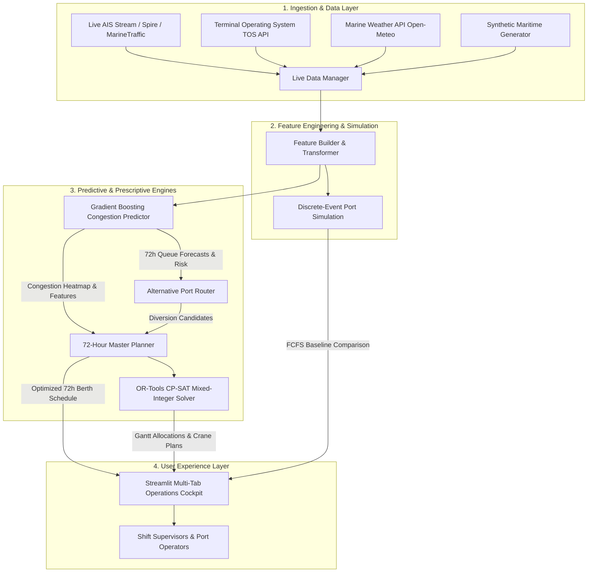

# Architecture

## 1. System Architecture Diagram

---

## 2. Components & Responsibilities

| Component | Module Path | Technology | Responsibility |
|---|---|---|---|
| **Configuration Engine** | `src/config/` | Python Dataclasses, PyYAML | Centralized settings, port specifications, physical berth/crane limits, and solver timeouts. |
| **Data Ingestion Stream** | `src/data/live/` & `src/data/generator.py` | Python, Requests, REST APIs | Interfaces with AIS telemetry, TOS databases, marine weather feeds, and synthetic generators. |
| **Feature Engineering** | `src/data/features.py` | Pandas, NumPy | Computes rolling arrival densities, berth occupancy ratios, crane workload estimates, and operational lags. |
| **Congestion Predictor** | `src/models/` | LightGBM / Scikit-Learn | Forecasts waiting ship queue lengths in 6-hour buckets across 72 hours with explainable contributing factors. |
| **Discrete-Event Simulator** | `src/simulation/port_sim.py` | Python Discrete-Event Engine | Simulates vessel queue dynamics, berth allocation cycles, and provides reproducible ground truth benchmarks. |
| **Alternative Port Router** | `src/optimization/router.py` | Multi-Criteria Optimization | Evaluates regional sister ports for vessel diversion when destination ports exceed congestion thresholds. |
| **Berth & Crane Allocator** | `src/optimization/berth_allocator.py` | Google OR-Tools (CP-SAT Solver) | Mixed-integer constraint programming solver assigning vessels to physical berths and cranes without overlaps. |
| **Master 72h Planner** | `src/optimization/planner.py` | Python | Coordinates predictive forecasts, solves the optimization problem, and computes KPI deltas against FCFS baseline. |
| **Operations Cockpit** | `src/app/dashboard.py` | Streamlit, Plotly, Pandas | Multi-tab interactive UI providing Gantt schedules, congestion heatmaps, live vessel map, and what-if simulation sliders. |

---

## 3. End-to-End Data Flow

1. **Ingestion & Normalization:** Telemetry data (vessel ETA, length, draft, cargo TEU) is received from AIS or the synthetic generator and transformed into standard `Vessel` and `PortSpec` domain entities.
2. **Feature Extraction:** `src/data/features.py` calculates rolling metrics over the 72-hour planning window, including arrival density per hour, total required service hours, and berth utilization.
3. **Congestion Prediction:** The trained model evaluates the feature vector and outputs `CongestionForecast` objects per port, detailing predicted queue length, congestion level (`LOW`, `MEDIUM`, `HIGH`, `CRITICAL`), and primary contributing factors.
4. **Prescriptive Optimization:**
   - Vessels with destination ports marked `HIGH` or `CRITICAL` are evaluated by `router.py` for potential diversion.
   - All assigned vessels are passed to `berth_allocator.py`, where OR-Tools CP-SAT creates interval variables representing `[berth_start, berth_end]` and enforces non-overlapping `AddNoOverlap2D` constraints across physical berth coordinates.
5. **Baseline Comparison:** The planner simultaneously calculates the standard First-Come, First-Served (FCFS) schedule to quantify net savings in vessel delay hours, berth idle time, and demurrage costs.
6. **Visualization & Supervision:** The schedule is rendered into an interactive Gantt chart in Streamlit, allowing shift supervisors to inspect individual vessel berth assignments and run what-if stress scenarios.

---

## 4. Security Considerations

- **Secret Management:** API keys for external AIS providers (`AIS_API_KEY`) and TOS connectors (`TOS_API_KEY`) are managed exclusively via environment variables and `.env` files, which are strictly ignored by `.gitignore`.
- **Stateless Architecture:** The backend optimization and forecasting pipeline is stateless and deterministic, preventing state corruption across multi-user requests.
- **Input Validation:** Strict type-checking and domain constraints (e.g., verifying vessel length $\le$ berth length and vessel draft $\le$ berth water depth) are enforced prior to optimization execution.

---

## 5. Scalability & Performance Notes

- **Multi-Core Solver Parallelism:** The CP-SAT solver is configured with `solver_workers: 8` for multi-threaded parallel search, solving complex 30+ vessel multi-berth schedules in $< 5$ seconds.
- **Rolling Window Decoupling:** Long-term schedules are partitioned into rolling 72-hour sliding horizons, keeping problem dimensionality bounded regardless of multi-year operational data volumes.
- **Caching & Rate Limiting:** Live data connectors feature configurable TTL caching (`live_cache_ttl_s: 60`) to prevent API rate-limit exhaustion against public AIS or weather providers.
